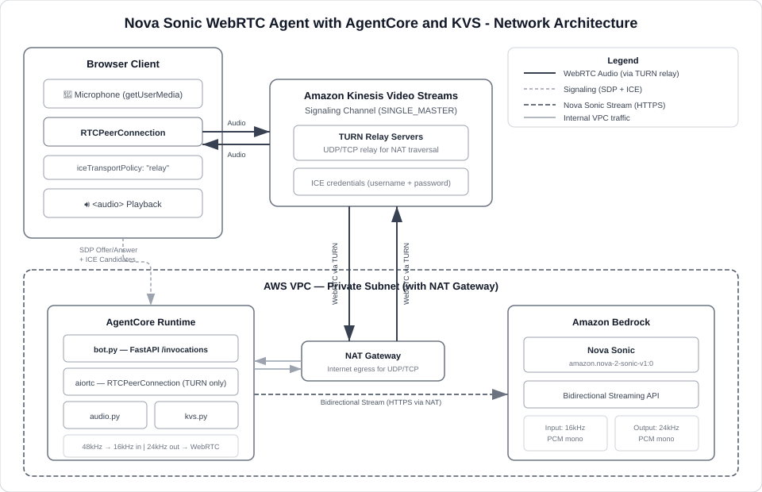

# Nova Sonic WebRTC Agent (KVS TURN)

A bidirectional voice agent using **Nova Sonic** with **WebRTC** audio transport via **Amazon Kinesis Video Streams (KVS)** TURN servers. Unlike the WebSocket-based samples (01–04), this agent uses WebRTC peer connections for lower-latency audio with built-in NAT traversal.

## Architecture



The browser captures microphone audio via WebRTC and relays it through KVS TURN servers to the agent running on AgentCore Runtime. The agent resamples the audio to 16kHz PCM, streams it to Nova Sonic, and plays back the 24kHz spoken response through the same WebRTC connection.

## Prerequisites

- **Python 3.12+** (required by `aws-sdk-bedrock-runtime`)
- AWS credentials configured (`AWS_ACCESS_KEY_ID`, `AWS_SECRET_ACCESS_KEY`, `AWS_REGION`)
- A **VPC with a private subnet** that has NAT gateway internet egress (see [Step 1](#step-1-set-up-a-vpc))

## Quick Start

| Step | What | Time |
|------|------|------|
| 1 | [Set up a VPC](#step-1-set-up-a-vpc) (skip if you have one) | ~5 min |
| 2 | [Deploy to AgentCore](#step-2-deploy-to-agentcore) | ~5 min |
| 3 | [Attach IAM permissions](#step-3-attach-iam-permissions) | ~1 min |
| 4 | [Connect from the browser](#step-4-connect-from-the-browser) | ~1 min |

---

## Step 1: Set Up a VPC

> **Already have a VPC?** You need a private subnet with NAT gateway access in a supported AZ. Skip to [Find your VPC parameters](#find-your-vpc-parameters) to look up the IDs, then go to [Step 2](#step-2-deploy-to-agentcore).

### Check supported availability zones

AgentCore Runtime only works in specific AZs. The mapping from AZ name to AZ ID varies per account:

```bash
aws ec2 describe-availability-zones \
  --query 'AvailabilityZones[*].{Name:ZoneName,ID:ZoneId}' \
  --output table
```

For `us-east-1`, supported AZ IDs are: **use1-az1**, **use1-az2**, **use1-az4**. Deploying to an unsupported AZ will fail.

### Create a VPC

1. Open the [VPC console](https://console.aws.amazon.com/vpc/) → **Create VPC** → **VPC and more**
2. Name it (e.g. `webrtc-bot-example`), keep default CIDR (`10.0.0.0/16`)
3. **1 AZ** (pick one that maps to a supported AZ ID), **1 public subnet**, **1 private subnet**
4. **NAT gateways: In 1 AZ**
5. Click **Create VPC**

### Find your VPC parameters

You'll need a **private subnet ID** and a **security group ID** for deployment:

```bash
# 1. Find your VPC ID
aws ec2 describe-vpcs --region us-east-1 \
  --query 'Vpcs[*].{VpcId:VpcId,Name:Tags[?Key==`Name`].Value|[0]}' \
  --output table

# 2. List subnets — pick the private one (typically named "...-private-...")
aws ec2 describe-subnets --region us-east-1 \
  --filters "Name=vpc-id,Values=YOUR_VPC_ID" \
  --query 'Subnets[*].{SubnetId:SubnetId,AZ:AvailabilityZone,Name:Tags[?Key==`Name`].Value|[0]}' \
  --output table

# 3. List security groups
aws ec2 describe-security-groups --region us-east-1 \
  --filters "Name=vpc-id,Values=YOUR_VPC_ID" \
  --query 'SecurityGroups[*].{GroupId:GroupId,Name:GroupName}' \
  --output table
```

### Verify the route table

Make sure the private subnet routes `0.0.0.0/0` through a NAT gateway (`nat-xxx`). Without this, the agent can't reach the internet and will time out on startup.

```bash
aws ec2 describe-route-tables \
  --filters "Name=association.subnet-id,Values=YOUR_PRIVATE_SUBNET_ID" \
  --query 'RouteTables[0].Routes' --output table
```

---

## Step 2: Deploy to AgentCore

This agent requires **VPC network mode** — PUBLIC mode doesn't support the outbound UDP connectivity needed for WebRTC/TURN.

```bash
# Navigate to the tutorial root
cd 01-tutorials/01-AgentCore-runtime/06-bi-directional-streaming

# Set up environment
python3 -m venv .venv && source .venv/bin/activate
pip install -r utils/requirements.txt

# Configure AWS
export ACCOUNT_ID=123456789012
export AWS_ACCESS_KEY_ID=your-access-key
export AWS_SECRET_ACCESS_KEY=your-secret-key
export AWS_REGION=us-east-1

# Deploy (replace with your subnet and security group from Step 1)
python utils/deploy.py 05-bedrock-sonic-kvs-wr \
  --subnet-ids subnet-0123456789abcdef0 \
  --security-group-id sg-0123456789abcdef0
```

> **Tip:** You can pass multiple subnets as a comma-separated list: `--subnet-ids subnet-aaa,subnet-bbb`

<details>
<summary>Alternative: manual deployment with AgentCore CLI</summary>

```bash
cd 05-bedrock-sonic-kvs-wr/websocket
pip install bedrock-agentcore-starter-toolkit

agentcore configure \
  -e bot.py \
  --deployment-type container \
  --disable-memory \
  --vpc \
  --subnets subnet-0123456789abcdef0 \
  --security-groups sg-0123456789abcdef0 \
  --non-interactive

agentcore deploy --env KVS_CHANNEL_NAME=voice-agent-minimal --env AWS_REGION=us-east-1
```
</details>

---

## Step 3: Attach IAM Permissions

The agent's execution role needs access to KVS (signaling/TURN) and Bedrock (Nova Sonic). Update `REGION` and `ACCOUNT_ID` in the policy files, then attach:

```bash
ROLE_NAME=WebSocket05-bedrock-sonic-kvs-wrAgentRole   # from deploy output

# KVS access (signaling channels + TURN)
aws iam put-role-policy \
  --role-name $ROLE_NAME \
  --policy-name kvs-access \
  --policy-document file://05-bedrock-sonic-kvs-wr/kvs-iam-policy.json

# Bedrock Nova Sonic access
aws iam put-role-policy \
  --role-name $ROLE_NAME \
  --policy-name bedrock-nova-sonic \
  --policy-document file://05-bedrock-sonic-kvs-wr/bedrock-iam-policy.json
```

> **Note:** The Bedrock policy uses an empty account ID in the ARN: `arn:aws:bedrock:REGION::foundation-model/amazon.nova-2-sonic-v1:0`

---

## Step 4: Connect from the Browser

```bash
./utils/start_client.sh 05-bedrock-sonic-kvs-wr
```

1. Enter the **Agent Runtime ARN** (from deploy output) and your AWS credentials
2. "Force TURN only" is auto-checked when an ARN is provided (required for VPC)
3. Click **Connect** and speak into your microphone

---

## Local Testing (No AWS Deployment)

Run everything locally without deploying to AgentCore:

```bash
# Terminal 1 — agent server
cd 05-bedrock-sonic-kvs-wr/websocket
pip install -r requirements.txt
cp .env.example .env   # add your AWS credentials
python bot.py           # → http://localhost:8080

# Terminal 2 — browser client
cd 05-bedrock-sonic-kvs-wr/client
pip install -r requirements.txt
python client.py        # → http://localhost:7860
```

Open `http://localhost:7860`, click **Connect** (no ARN needed locally).

---

## Cleanup

```bash
python utils/cleanup.py 05-bedrock-sonic-kvs-wr
```

---

## How It Works

### Audio flow

| Direction | Path |
|-----------|------|
| Browser → Nova Sonic | Mic (48kHz) → WebRTC → KVS TURN → Agent → `av.AudioResampler` (16kHz PCM) → Nova Sonic |
| Nova Sonic → Browser | Nova Sonic (24kHz PCM) → `av.AudioFifo` → `OutputTrack` (20ms frames) → WebRTC → KVS TURN → `<audio>` |

### Why TURN relay?

The agent runs in a VPC private subnet behind NAT — direct peer-to-peer isn't possible. Both sides use KVS TURN:
- Agent: fetches TURN credentials with `client_id="server"`, forces `turn_only=True`
- Browser: fetches TURN credentials with `client_id="web-client"`, auto-enables relay when an ARN is provided

### Audio configuration

| Parameter | Value |
|-----------|-------|
| Input sample rate | 16 kHz |
| Output sample rate | 24 kHz |
| Format | 16-bit PCM mono |
| Model | `amazon.nova-2-sonic-v1:0` |
| Voice | `matthew` |

---

## Project Structure

```
websocket/                    # Agent (runs on AgentCore Runtime)
  bot.py                      #   FastAPI server — WebRTC offer/answer, ICE handling
  kvs.py                      #   KVS signaling channel + TURN credential helpers
  audio.py                    #   Audio resampling and WebRTC output track
  nova_sonic.py               #   Nova Sonic bidirectional streaming session
  requirements.txt
  Dockerfile
  .env.example
client/                       # Browser client
  index.html                  #   WebRTC UI + optional AgentCore Runtime invocation
  client.py                   #   Static file server
  requirements.txt
kvs-iam-policy.json           # IAM policy for KVS
bedrock-iam-policy.json       # IAM policy for Nova Sonic
```

---

## Troubleshooting

| Problem | Cause | Fix |
|---------|-------|-----|
| Deployment fails with "unsupported availability zones" | Subnet is in an AZ AgentCore doesn't support | Use a subnet in `use1-az1`, `use1-az2`, or `use1-az4`. See [Step 1](#check-supported-availability-zones) |
| Runtime initialization timeout (120s) | Agent can't reach the internet | Verify private subnet routes `0.0.0.0/0` to a NAT gateway |
| STUN transaction failed (403) | Agent not using TURN relay | Ensure `turn_only=True` in `bot.py` and "Force TURN only" checked in browser |
| No audio playback | Mic permissions or TURN not enabled | Check mic permissions; ensure "Force TURN only" is checked for AgentCore deployments |

Check agent logs:
```bash
aws logs tail /aws/bedrock-agentcore/runtimes/YOUR_AGENT_ID-DEFAULT \
  --log-stream-name-prefix "$(date -u +%Y/%m/%d)/[runtime-logs]" --since 10m
```

---

## Key Dependencies

| Package | Purpose |
|---------|---------|
| `aws-sdk-bedrock-runtime` | Nova Sonic streaming (Python 3.12+) |
| `aiortc` | WebRTC peer connections |
| `av` | Audio resampling and frame buffering (FFmpeg) |
| `boto3` | KVS signaling channels and TURN servers |
| `fastapi` / `uvicorn` | HTTP server |
