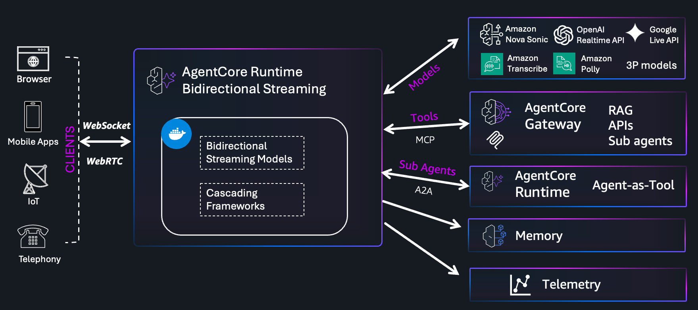

# Bidirectional Streaming Voice Agents on AgentCore Runtime

Build real-time voice agents using [Amazon Nova Sonic](https://docs.aws.amazon.com/bedrock/latest/userguide/nova-sonic.html) and deploy them to [Amazon Bedrock AgentCore Runtime](https://docs.aws.amazon.com/bedrock-agentcore/latest/devguide/runtime-get-started-toolkit.html).



## Why AgentCore for Voice Agents?

Voice agents need persistent, low-latency connections — a browser streams audio in, the agent processes it through a model, and streams spoken responses back. [AgentCore Runtime](https://docs.aws.amazon.com/bedrock-agentcore/) provides the managed infrastructure to make this work in production:

- **WebSocket proxy with SigV4 authentication** — clients connect through AgentCore's authenticated endpoint, so your agent doesn't need to handle auth
- **WebRTC support via KVS TURN** — deploy WebRTC agents in VPC with NAT traversal through Amazon Kinesis Video Streams TURN servers, enabling low-latency peer-to-peer audio without exposing your agent to the public internet
- **Container deployment via CodeBuild** — package your agent as a Docker container and deploy without managing infrastructure (no local Docker required)
- **IAM role management** — AgentCore provisions execution roles with Bedrock model access
- **MCP Gateway integration** — connect agents to external tools (databases, APIs, knowledge bases) through the [Model Context Protocol](https://docs.aws.amazon.com/bedrock-agentcore/latest/devguide/mcp-gateway.html)
- **Auto-scaling and lifecycle management** — AgentCore handles scaling and health checks

## Architecture Patterns

These samples demonstrate two architecture patterns for voice agents:

**Native Speech-to-Speech (S2S)** — Audio flows directly into a model that understands speech and responds with speech. Nova Sonic, Gemini, and OpenAI Realtime all support this natively. Lower latency, simpler pipeline, built-in VAD and barge-in.

**Sandwich (STT → LLM → TTS)** — Audio is transcribed to text, processed by a text LLM, then synthesized back to speech. More flexible (any text LLM works), but higher latency due to the sequential pipeline.

## Samples

| # | Sample | Architecture | Framework | Key Feature |
|---|--------|-------------|-----------|-------------|
| 01 | [Bedrock Sonic](01-bedrock-sonic-ws/) | Native S2S | Raw Bedrock SDK | Full protocol control, low-level event handling |
| 02 | [Strands](02-strands-ws/) | Native S2S (multi-model) | Strands BidiAgent | MCP Gateways, multi-model (Nova Sonic / Gemini / OpenAI) |
| 03 | [LangChain + Transcribe + Polly](03-langchain-transcribe-polly-ws/) | Sandwich (STT→LLM→TTS) | LangChain + Transcribe + Polly | Text LLM with voice I/O pipeline, custom VAD |
| 04 | [Pipecat Sonic](04-pipecat-sonic-ws/) | Native S2S | Pipecat pipeline | Open-source framework, RTVI/Protobuf, Silero VAD |
| 05 | [Bedrock Sonic KVS WebRTC](05-bedrock-sonic-kvs-wr/) | Native S2S | Raw Bedrock SDK + aiortc | WebRTC audio via KVS TURN, NAT traversal, VPC deployment |

### [01 — Bedrock Sonic](01-bedrock-sonic-ws/README.md)

Direct implementation using the raw Bedrock Runtime SDK. Manages the bidirectional stream, event protocol, and session lifecycle manually. Best for understanding the Nova Sonic protocol or building custom integrations that need fine-grained control.

### [02 — Strands](02-strands-ws/README.md)

Banking assistant supporting three S2S models (Nova Sonic, Gemini, OpenAI) via the Strands `BidiAgent` SDK. Four MCP Gateways provide modular tool access for authentication, banking, mortgage, and FAQ services. The most feature-rich sample.

### [03 — LangChain + Transcribe + Polly](03-langchain-transcribe-polly-ws/README.md)

Demonstrates the STT → Agent → TTS "sandwich" pattern using Amazon Transcribe for speech recognition, LangChain with Bedrock Nova 2 Lite for reasoning, and Amazon Polly for speech synthesis. Useful for understanding the tradeoffs between text-based LLM pipelines and native S2S models.

### [04 — Pipecat Sonic](04-pipecat-sonic-ws/README.md)

Uses the [Pipecat](https://github.com/pipecat-ai/pipecat) open-source framework with `AWSNovaSonicLLMService` for native speech-to-speech. Includes Silero VAD, RTVI protocol with Protobuf serialization, and a Vite-based browser client.

### [05 — Bedrock Sonic KVS WebRTC](05-bedrock-sonic-kvs-wr/README.md)

WebRTC-based voice agent using Nova Sonic with KVS TURN servers for audio transport. Unlike the WebSocket samples (01–04), this uses `aiortc` peer connections for browser-to-agent audio streaming with built-in NAT traversal. Designed for VPC deployments where direct peer-to-peer connections aren't possible.

## Getting Started

Each sample includes its own README with setup, deployment, and local testing instructions. Pick a sample and follow its guide:

- [01-bedrock-sonic-ws/README.md](01-bedrock-sonic-ws/README.md) — start here to understand the raw protocol
- [02-strands-ws/README.md](02-strands-ws/README.md) — start here for the full-featured agent with tools
- [03-langchain-transcribe-polly-ws/README.md](03-langchain-transcribe-polly-ws/README.md) — start here for the sandwich architecture
- [04-pipecat-sonic-ws/README.md](04-pipecat-sonic-ws/README.md) — start here for the Pipecat framework
- [05-bedrock-sonic-kvs-wr/README.md](05-bedrock-sonic-kvs-wr/README.md) — start here for WebRTC with KVS TURN

## Project Structure

```
├── utils/                             # Shared deploy/cleanup scripts
├── 01-bedrock-sonic-ws/               # Native Nova Sonic (raw SDK)
│   ├── websocket/                     #   Server + Dockerfile
│   └── client/                        #   Browser client
├── 02-strands-ws/                     # Strands BidiAgent (multi-model)
│   ├── websocket/                     #   Server + Dockerfile
│   ├── client/                        #   Browser client
│   └── mcp/                           #   MCP server implementations
├── 03-langchain-transcribe-polly-ws/  # LangChain sandwich (STT→LLM→TTS)
│   ├── websocket/                     #   Server + Dockerfile
│   └── client/                        #   Browser client
├── 04-pipecat-sonic-ws/               # Pipecat framework (Nova Sonic)
│   ├── websocket/                     #   Server + Dockerfile
│   └── client/                        #   Vite app + signing server
├── 05-bedrock-sonic-kvs-wr/           # WebRTC via KVS TURN (Nova Sonic)
│   ├── websocket/                     #   Server + Dockerfile (aiortc)
│   └── client/                        #   Browser WebRTC client
└── assets/                            # Architecture diagrams
```

## Resources

- [AgentCore Runtime Documentation](https://docs.aws.amazon.com/bedrock-agentcore/)
- [AgentCore Starter Toolkit](https://docs.aws.amazon.com/bedrock-agentcore/latest/devguide/runtime-get-started-toolkit.html)
- [AgentCore MCP Gateway](https://docs.aws.amazon.com/bedrock-agentcore/latest/devguide/mcp-gateway.html)
- [Amazon Nova Sonic](https://docs.aws.amazon.com/nova/latest/nova2-userguide/using-conversational-speech.html)
- [Strands Agents SDK](https://strandsagents.com/docs/user-guide/concepts/bidirectional-streaming/quickstart)
- [Pipecat Framework](https://github.com/pipecat-ai/pipecat)
- [Model Context Protocol (MCP)](https://modelcontextprotocol.io/)
