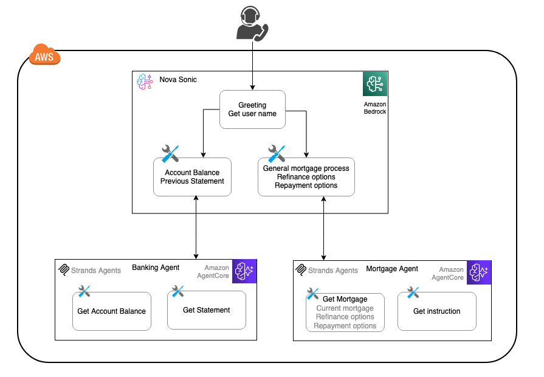

# Nova Sonic integration with AgentCore 

The [Amazon Nova Sonic model](https://aws.amazon.com/ai/generative-ai/nova/speech/) provides real-time, conversational interactions through bidirectional audio streaming, enabling natural, human-like conversational experiences.

## Nova Sonic Multi-Agent Architecture with AgentCore and Strands

Multi-agent architecture is a widely used pattern for designing AI assistants. In a voice assistant like Nova Sonic, this architecture coordinates multiple specialized agents to handle complex tasks. Each agent can operate independently, enabling parallel processing, modular design, and scalable solutions.

In this sample, we will use a banking voice assistant as a sample to demonstrate how to deploy specialized agents on [Amazon Bedrock AgentCore](https://aws.amazon.com/bedrock/agentcore/). We will use Nova Sonic as an orchestrator to delegate detailed inquiries to sub-agents written in [Strands Agents](https://strandsagents.com/latest/documentation/docs/) hosted on [AgentCore Runtime](https://docs.aws.amazon.com/bedrock-agentcore/latest/devguide/agents-tools-runtime.html).

The conversation flow begins with a greeting and collecting the user’s name, and then it can handle inquiries related to banking or mortgages. We use two sub-agents hosted on AgentCore to handle specialized logic:
- Banking Sub-Agent: Handles account balance checks, statements, and other banking-related inquiries.
- Mortgage Sub-Agent: Handles mortgage-related inquiries, including refinancing, rates, and repayment options.

> The Mortgage Agent and Banking Agent deployed on AgentCore Runtime return static responses. This sample is intended to showcase the architecture pattern and deployment process. In a real-world application, these agents would retrieve data from sources such as APIs, databases, RAG, or other backend services.

## Deploy the Sample Code
For sample code and full deployment instructions, please refer to the [amazon-nova-sample](https://github.com/aws-samples/amazon-nova-samples/tree/main/speech-to-speech/workshops/agent-core) repository.
